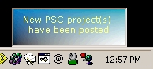



## PSC Alert \(Detect new Submission\)

### Description

PSC Alert will run in your system tray and monitor PSC's VB ticker. When it detects a new posting, it will alert you by displaying a small window for a few seconds down by the tray, playing a sound effect, and flashing the tray icon. Before you download, let me tell you now that the project does use an OCX which is not included but the URL to obtain the OCX is in the read me along with more information about where to learn more about my and my coding. You can also look at my BIO above to see I am a regular here along with a PSC Contest winner. I am not some joker out to cause problems.
 
### More Info
 

             |
---                |---
**Submitted On**   |2001-09-20 12:52:18
**By**             |[Clint LaFever](https://github.com/Planet-Source-Code/PSCIndex/blob/master/ByAuthor/clint-lafever.md)
**Level**          |Beginner
**User Rating**    |4.1 (37 globes from 9 users)
**Compatibility**  |VB 6\.0
**Category**       |[Complete Applications](https://github.com/Planet-Source-Code/PSCIndex/blob/master/ByCategory/complete-applications__1-27.md)
**World**          |[Visual Basic](https://github.com/Planet-Source-Code/PSCIndex/blob/master/ByWorld/visual-basic.md)
**Archive File**   |[PSC Alert 267259202001\.zip](https://github.com/Planet-Source-Code/clint-lafever-psc-alert-detect-new-submission__1-27414/archive/master.zip)

